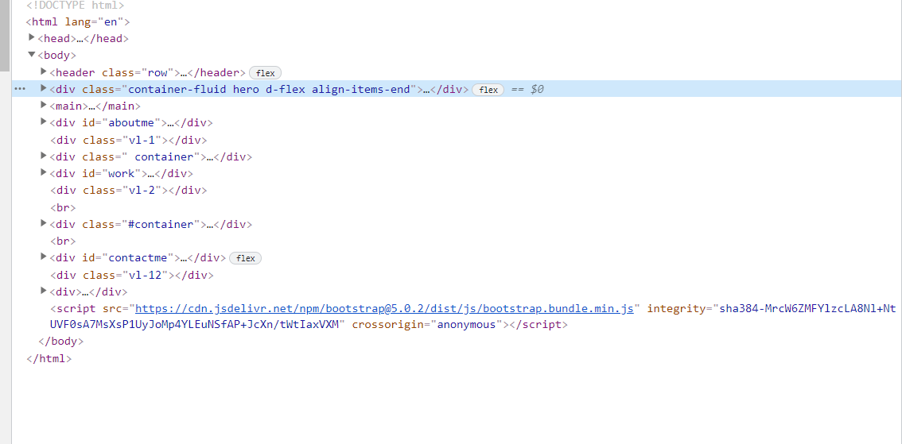

# Jeff-Lynch

## Description

This project is an insight to my portfolio of my professional accomplishments.

## Table of Contents (Optional)

- [Installation](#installation)

- [Usage](#usage)

- [License](#license)

## Installation

>The first thing you need to go into VS Code and create our portfolio file
>Set-up HTML and style css to give an outline to this project.
>Add an HTML cover page to give the project a more professional look.

## Usage

## License

[http://www.apache.org/licenses/LICENSE-2.0](http://www.apache.org/licenses/LICENSE-2.0)
Copyright 2021 

    Licensed under the Apache License, Version 2.0 (the "License");
    you may not use this file except in compliance with the License.
    You may obtain a copy of the License at
    
        http://www.apache.org/licenses/LICENSE-2.0
    
    Unless required by applicable law or agreed to in writing, software
    distributed under the License is distributed on an "AS IS" BASIS,
    WITHOUT WARRANTIES OR CONDITIONS OF ANY KIND, either express or implied.
    See the License for the specific language governing permissions and
    limitations under the License.
